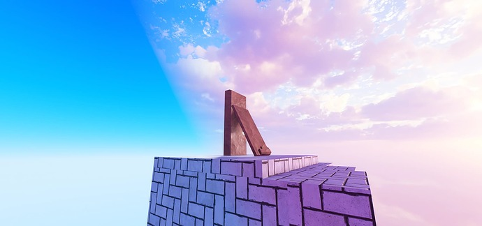
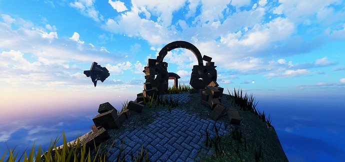

  

  
<b>Table of Contents</b>

  <ul>
    <li><a href="./README.md#demonstrations">Demonstrations</a></li>
    <li><a href="./README.md#plugin-presets">Plugin Presets</a></li>
    <li><a href="./README.md#user-presets">User Presets</a></li>
    <li><a href="./README.md#autosaves">Autosaves</a></li>
    <li><a href="./README.md#faq">FAQ</a></li>
  </ul>

  
<b>Get Luminos</b>

  <ul>
    <li><a href="https://builtbybit.com/resources/luminos.43303/">BuiltByBit</a></li>
    <li><a href="https://clearlydev.com/product/luminos-lighting-at-your-fingertips/">ClearlyDev</a></li>
    <li><a href="https://github.com/CodeBLACKBEARD/LUMINOS">GitHub</a></li>
    <li><a href="https://glitching-dreams.itch.io/luminos">Itch</a></li>
    <li><a href="https://create.roblox.com/store/asset/17188739293/Luminos">Roblox Creator Store</a></li>
  </ul>

  
<b>Why Luminos is Now Free & Open-Source</b>

  I used to charge $1.99 for this tool. Then I realized I was part of the problem I complain about.

  Every paywall, no matter how small, creates two groups: those who can access opportunity and those who can’t. I’ve watched talented developers held back not by lack of skill, but by lack of resources. I’ve been there myself; passed over by higher-ups who promised the world and delivered nothing but broken trust.

  The system is rigged. Corporate promises are hollow. The same people who preach “meritocracy” make sure the merit is locked behind paywalls they control.

  So I’m doing what I can with what I have. Maybe it’s just a small dev tool. Maybe it won’t change the world. But if it helps even one person build something amazing, create something meaningful, or just get one step closer to their goals without having to choose between rent and software, then it’s worth it.

  Everyone deserves equal opportunity to succeed. Not equal outcomes - equal opportunity. That starts with removing barriers, not adding them.

  This is my small rebellion against a system that profits from artificial scarcity. Use it, improve it, share it. <a href="https://x.com/CodeBLACKBEARD">#CodeBLACKBEARD</a>

 

 

  
Lighting is crucial for setting the tone and atmosphere in your experiences. But getting it just right can be tricky and time-consuming.

  
  
Enter <b>Luminos</b> - a cutting-edge plugin that puts striking, cinema-quality lighting at your fingertips.

  

  &nbsp;
  
  From dramatic sunsets to vibrant cartoon skies, Luminos provides an array of gorgeous, artfully-crafted presets to instantly elevate your game’s visuals. With this lovingly crafted lighting library, beautifying your environments has never been easier.

 

 

  <h3 id="Demonstrations">Demonstrations</h3>

  
  

 

 

  <h3 id="Plugin Presets">Plugin Presets</h3>

  To change your lighting with Luminos, simply select one of the presets from the plugin interface, and watch as it applies a complete makeover to your experience’s lighting, atmosphere, skies, color grading, and more.

    

  &nbsp;
  
  Luminos currently comes equipped with 13 uniquely beautiful presets:

  <table>
    <tr><td><b>After Rain</b> by <i>Mayhem</i></td></tr>
    <tr><td><b>Another Planet</b> by <i>RPGWhitelock</i></td></tr>
    <tr><td><b>Blue Nebula</b> by <i>TonyS</i></td></tr>
    <tr><td><b>Cartoon Blue Sky</b> by <i>RPGWhitelock</i></td></tr>
    <tr><td><b>Cartoon Night Sky</b> by <i>RPGWhitelock</i></td></tr>
    <tr><td><b>Cold Night</b> by <i>RPGWhitelock</i></td></tr>
    <tr><td><b>Cold Sunset</b> by <i>RPGWhitelock</i></td></tr>
    <tr><td><b>Corona</b> by <i>Ulukai</i></td></tr>
    <tr><td><b>Epic Blue Sunset</b> by <i>RPGWhitelock</i></td></tr>
    <tr><td><b>Glorious Pink</b> by <i>RPGWhitelock</i></td></tr>
    <tr><td><b>Overcast Low</b> by <i>RPGWhitelock</i></td></tr>
    <tr><td><b>Shattered</b> by <i>Mayhem</i></td></tr>
    <tr><td><b>Silver and Gold Nebulae</b> by <i>TonyS</i></td></tr>
   </table>

  <h6><b>[Authors credited for their provision of the presets' skyboxes.]</b></h6>

 

 

  <h3 id="User Presets">User Presets</h3>

  Once you’ve adjusted your lighting to the look you’re after, save it as a custom user preset. With Luminos, you can build up an ever-expanding library of lighting setups, ready to be recalled whenever.

  

  &nbsp;
  
  Want to make any changes? You can always overwrite a preset you've previously made by saving with the same name. Another way to alter your User Presets is by manually altering a preset's module. <a href="FindUserPresetsInExplorer">[See FAQ]</a>

   

 

 

  <h3 id="Autosaves">Autosaves</h3>

  Sometimes, one little mistake is all it takes for your time and effort goes to waste. With Luminos’ autosave functionality, you don’t have to start at square one. The plugin automatically saves a backup of your latest lighting tweaks every time you open it, letting you easily restore your previous work with a couple clicks.

  

  &nbsp;

  By default, Luminos will store up to 10 autosaves. You can change this by typing in your preferred number of max autosaves.

 

 

<h3 id="FAQ">
FAQ
</h3>

  
<b>What Happens If I Delete the Luminos Folders in Explorer?</b>

  This will delete all of your User Presets and Autosaves. These folders will be made again upon opening the plugin, but everything that was deleted is gone for good.

  
<b>How Do I Install User Presets?</b>

  Insert the module for your new User Preset into the <a href="./README.md#find-user-presets-in-explorer">User Presets folder</a>.

  
<b>What Is Meant by Missing Lighting Components?</b>

  If `game:GetService("Lighting")` does not have an Atmosphere, Sky, ColorCorrection, or Sunrays, Luminos will push a warning to output, reminding you that these components are missing. The plugin will still load and save presets without error, just without the missing component(s).

  
<b>How Can I Share User Presets?</b>

  You can <a href="./README.md#find-user-presets-in-explorer">find the modules for your User Presets in Explorer</a>, then save them as models or copy their code to share them.

  
<b>Where Do I Find User Presets and Autosaves in Explorer?</b>

  They are all located in `ServerStorage` under the `Luminos` folder. If the folder does not exist, open the plugin to create them.

 

<h6>
© 2025 Colby Craig ("BLACKBEARD")
 
Licensed under GPL - 3.0
</h6>
